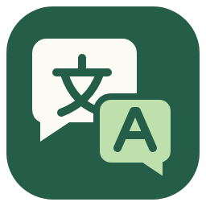
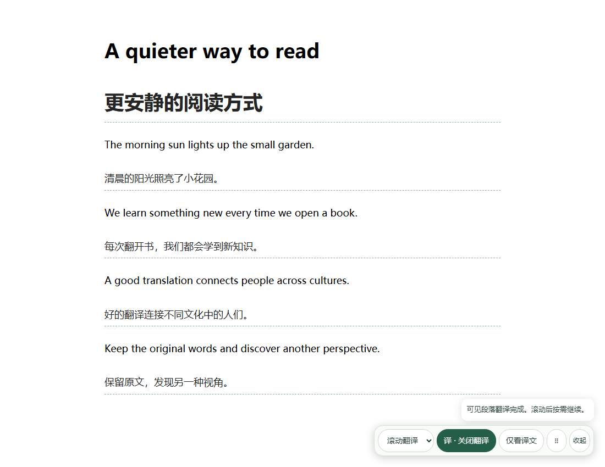
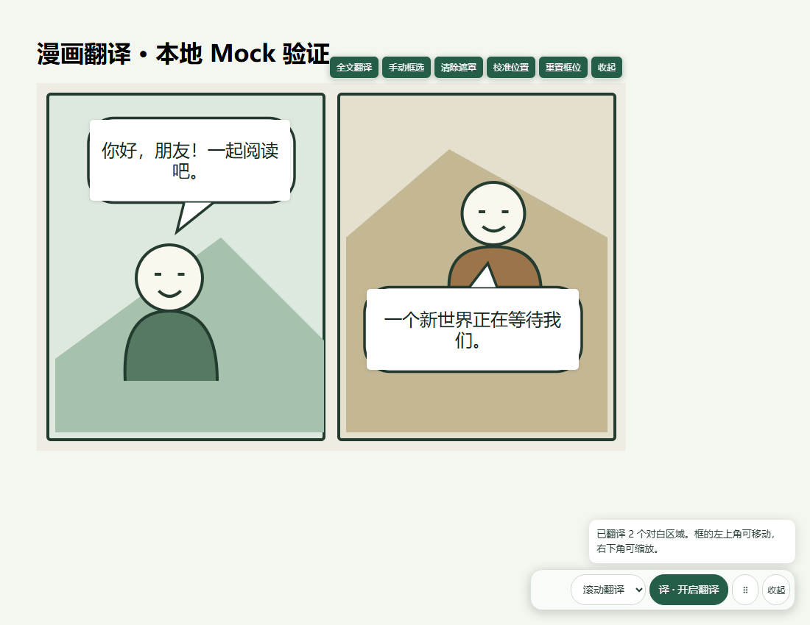
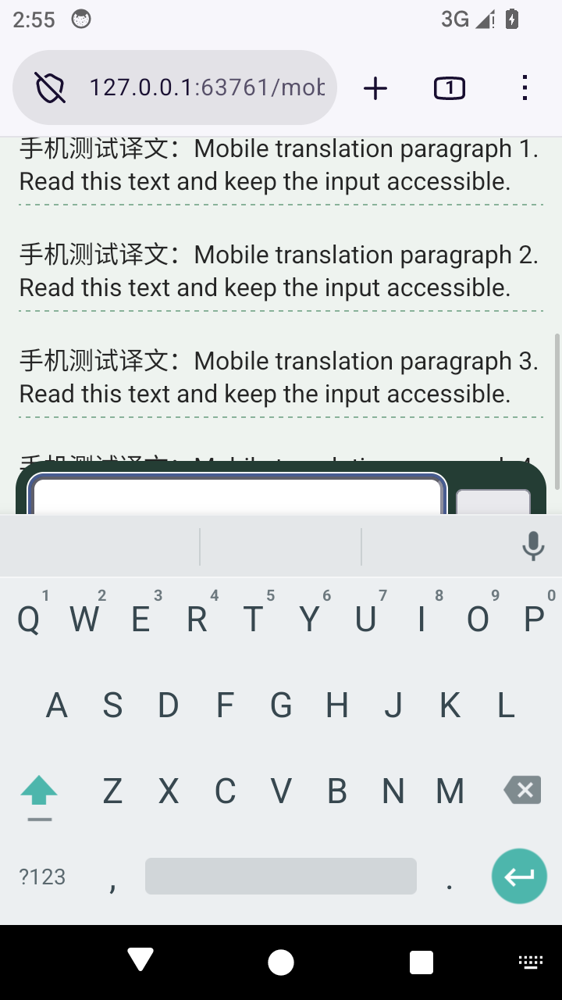

<p align="center">
  
</p>

# 双语轻译 · Bilingual Lite

> **自用项目声明**：本项目完全由 **GPT-6 Astra** 以 **vibe coding** 方式开发，公开源码仅供有相同需求的人参考和使用。**不对可靠性、准确性、安全性、兼容性或后续维护作任何保证**，也不承诺更新、问题修复或回复 Issue。请自行评估并承担使用风险。文中的测试记录仅描述特定环境下的结果，不构成质量或维护承诺。

轻量的网页与漫画翻译扩展，支持 **Chrome / Firefox Manifest V3**。使用自己的 API Key，自选 OpenAI 兼容服务和模型。原生 TypeScript / CSS，无 UI 框架，无需安装 Python 或本地 OCR。

[Firefox 商店安装](https://addons.mozilla.org/zh-CN/firefox/addon/bilingual-lite/) · [下载 v0.4.0](https://github.com/cyreneEGO093/bilingual-lite/releases/tag/v0.4.0) · [详细使用指南](USAGE.md) · [隐私说明](PRIVACY.md) · [反馈问题](https://github.com/cyreneEGO093/bilingual-lite/issues)

> Firefox 版已在 Mozilla 附加组件商店上架。GitHub 的 Firefox ZIP 用于临时加载和提交审核，未签名；商店版本可能晚于 GitHub，请以商店显示的版本号为准。扩展本身免费；所选 API 服务可能按用量收费。

## 可以做什么

- **网页双语阅读**：在原段落下插入译文，切换双语／仅译文，关闭后恢复原文。
- **滚动或整页翻译**：按视口翻译可见内容，或分批处理当前已加载的整页正文；支持页面动态追加的内容。
- **漫画整图与框选**：悬停图片后翻译整图，或拖出选区只翻译局部气泡。
- **可调整译文框**：移动、缩放、隐藏／恢复，设置默认大小与背景透明度。
- **作品背景与术语表**：统一角色、技能和职业等专有名词，网页、整图及框选共用。
- **异常恢复**：单批格式错误保留原文和已完成译文，可单独重试未完成部分。
- **移动端操作**：Firefox Android 支持长按图片打开工具栏；翻译入口可拖动、收起，避开输入区并跟随软键盘调整位置。
- **BYOK 配置**：自选服务地址、文本／图片模型与目标语言；支持兼容的本机回环服务。

### 交互预览

以下截图使用项目自建样页及模拟译文，展示交互，不代表模型翻译质量。





Android 模拟器：输入时收起入口并避开软键盘。



## 下载与安装

前往 [Releases](https://github.com/cyreneEGO093/bilingual-lite/releases)。请按用途选择文件：

| 文件 | 用途 |
|---|---|
| `bilingual-lite-0.4.0-chrome.zip` | Chrome 安装文件；Edge 可按下述方法加载同一包 |
| `bilingual-lite-0.4.0-firefox.zip` | Firefox 临时加载／商店提交文件，未签名 |
| `bilingual-lite-0.4.0-source.zip` | 完整对应源码、锁文件、构建材料与第三方许可 |
| `bilingual-lite-0.4.0-SHA256.txt` | 下载文件的 SHA-256 校验值 |

安装包仅含运行代码、图标以及必要的许可和隐私资源，不含交付说明、测试样图或 API Key。

### Chrome / Edge

1. 下载并解压 `chrome.zip`，确认解压后的目录直接包含 `manifest.json`。
2. 打开 `chrome://extensions` 或 `edge://extensions`，开启“开发者模式”。
3. 点击“加载已解压的扩展程序”，选择该目录。

Chrome 已完成实际扩展测试；Edge 使用相同的 Chromium 包，本版本未单独完成 Edge 交互验收。

### Firefox 140+

日常使用请从 [Mozilla 附加组件商店](https://addons.mozilla.org/zh-CN/firefox/addon/bilingual-lite/) 安装，后续已审核版本可通过商店更新。

0.4.0 沿用 0.3.2 的扩展标识。0.3.0 / 0.3.1 使用旧标识，设置无法自动迁移，请重新配置。

开发或审核时可临时加载 GitHub 安装包：

1. 下载并解压 `firefox.zip`。
2. 打开 `about:debugging#/runtime/this-firefox`，点击“临时载入附加组件”。
3. 选择解压目录内的 `manifest.json`。

临时扩展在 Firefox 重启后会卸载；商店安装不受此限制。

### Firefox Android 142+

0.4.0 加入 Android 适配，已在 Android 14 模拟器的 Firefox 157 中完成实际扩展测试；尚未在实体手机上验收。日常安装需要等待对应版本通过商店审核并启用 Android 兼容性。GitHub 的未签名 ZIP 不能直接作为普通手机安装包，开发调试见 [BUILDING.md](BUILDING.md)。不支持 iOS Firefox。

手机上点击圆形“译”按钮展开面板；拖动圆形入口或面板的点阵手柄可移动，点击“收起”缩回。长按图片约半秒打开图片工具栏，再选择整图或框选翻译；直接滑动图片仍用于浏览页面。

## 第一次使用

1. 打开扩展设置，填写 API Key 并保存。默认地址为 `https://openrouter.ai/api/v1`；文本和图片模型默认均为 `deepseek/deepseek-v4.1-flash`，目标语言为简体中文。
2. 点击“连接并查询模型”核对服务连接和模型列表。图片翻译需要所选模型支持图像输入；模型可用性和价格以服务提供者为准。
3. 刷新已有网页。选择“滚动翻译”或“整页翻译”，点击右下角“开启翻译”，也可按 `Alt+Shift+T`。
4. 漫画图片展示尺寸大于 300×300 时，悬停显示工具栏；点击“全文翻译”或“手动框选”。

面板会尽量避让输入框、发送按钮等页面控件，聚焦页面输入框时自动收起。特殊布局下仍可能遮挡，可拖到合适位置；位置只在当前页面保留。桌面使用快捷键，触屏使用浮动入口；手机图片可在较小显示尺寸下长按操作。

升级时覆盖原扩展目录、在扩展管理页重新加载，再刷新网页。已有用户保存的模型不会被新版默认值覆盖；如需更换，请在设置中修改。

更多外观设置、术语格式、快捷操作和故障处理见 [使用指南](USAGE.md)。

## 隐私与费用

- API Key 和配置保存在浏览器本地，不通过扩展同步；扩展没有开发者托管的翻译服务器、遥测或广告。
- 开启翻译后，待译文本／图片及设置中的背景、术语会发送给你配置的 API 服务。Key 用于该服务认证，第三方可能保留请求数据或收取费用。
- 图片先裁切、再等比例压缩到长边不超过 1280px。并发最多 3，输出上限 1500 Token，并显式请求关闭推理思考；第三方能否遵守参数取决于服务实现。
- 整页翻译和重试会增加用量。输出限制不等于费用封顶，建议在服务端为 Key 设置预算。
- HTTP(S) 网站权限用于在网页中显示翻译、访问自选 API 及下载跨域图片；Pixiv 来源规则仅用于扩展自身的图片下载。

详见 [完整隐私说明](PRIVACY.md)。请勿在 Issue、截图或提交记录中公开 API Key。

## 已知限制

模型可能识别错误、漏译、误译或给出偏移坐标。框选和手动调整可帮助修正，但不保证准确率。术语表是模型参考，也不能保证每次严格遵守。

浏览器内部页面、扩展商店、内置 PDF 等受保护页面不支持注入。当前不处理 iframe 内正文、网站自身 Shadow DOM、复杂旋转／透视图片，也不提供擦字修复和重绘。部分需要登录或拒绝下载的图片仍可能失败。隐私窗口不启用扩展。

整页模式只处理页面实际加载到 DOM 的内容，不会代替用户翻页、展开正文或加载尚未出现的后续章节。

## 开发与验证

使用 Node.js 24 和 npm：

```sh
npm ci
npm test
npm run build
npm run lint:firefox
npm run zip
```

构建目录为 `dist/chrome-mv3/` 和 `dist/firefox-mv3/`。开发模式使用 `npm run dev` 或 `npm run dev:firefox`。构建和自动测试无需 API Key；付费模型测试不会自动执行。

v0.4.0 已完成 95 项自动测试、桌面 Chrome 153 / Firefox 155 及 Android 14 模拟器 Firefox 157 的实际扩展交互测试。移动端验证包含原生触摸、软键盘、输入与发送按钮、长按图片、框选、译文框拖动／缩放和横屏。Mozilla 检查为 0 errors / 0 warnings / 0 notices。测试全部使用本地模拟 API，不消耗付费模型额度，也不代表该版本已获商店审核或保证模型质量。

- [构建复现与无需付费 API 的本地验收](BUILDING.md)
- [来源、许可证与发布检查](COMPLIANCE.md)
- [完整操作及实现说明](USAGE.md)

## 问题反馈

请通过 [GitHub Issues](https://github.com/cyreneEGO093/bilingual-lite/issues) 提供浏览器及版本、扩展版本、模型名称、复现步骤和错误提示。样图或页面链接请确认可以公开分享；移除 API Key、个人信息和私有内容。

## 开源许可

项目以 **GPL-3.0-only** 发布，完整许可见 [LICENSE](LICENSE)，版权和适用范围见 [COPYRIGHT.md](COPYRIGHT.md)。第三方运行时代码保留各自的 MIT 许可，见 [THIRD_PARTY_NOTICES.txt](THIRD_PARTY_NOTICES.txt)。

对应版本的完整源码可从本仓库和 [Release 源码附件](https://github.com/cyreneEGO093/bilingual-lite/releases/download/v0.4.0/bilingual-lite-0.4.0-source.zip) 获取。再分发修改版时，请按许可证保留声明并提供相应源码。本项目不提供任何担保，不保证可靠性或后续维护。
